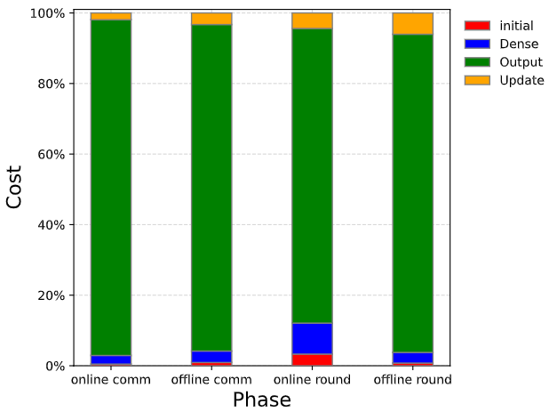
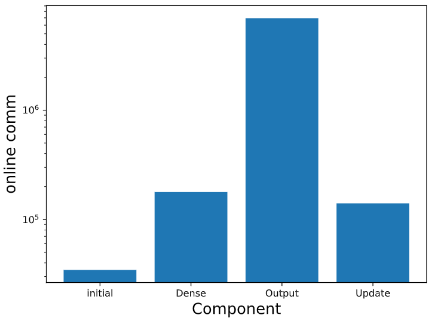

# <center> Garnet（石榴石） 
<div align=center></div>
<br><br>

<p align="justify">Garnet（石榴石） 是继SecMML（Queqiao）后，由复旦大学数据安全与治理研究组开发并开源的又一个安全多方学习（MPL：Multi-party Learning）框架，其深度优化并扩展自MP-SPDZ（CCS 2020），并适配安全多方学习的特定功能需求。相较前一个版本SecMML (Queqiao)，Garnet是一个高效、易用、功能多样的安全多方学习框架。当前，Garnet支持多种安全多方计算协议，例如：半诚实两方场景下的SecureML协议（Garnet新增）、任意多方不诚实大多数+恶意场景下的SPDZ协议等。用户可以使用类Python的脚本语言调用三方诚实大多数+半诚实安全模型场景下的XGBoost（Garnet新增）模型安全训练功能以及预训练模型的安全微调（Garnet新增）功能。此外，Garnet还支持多场景（任意参与方数，诚实大多数+半诚实，不诚实大多数+半诚实等）下的逻辑回归、神经网络等机器学习模型的安全训练功能。</p>


## 部署
当前Garnet支持Linux 2014以上以及MacOS  High Sierra之后的操作系统版本。

### 源码下载
```
git clone git@github.com:FudanMPL/Garnet.git
```

### 外部库准备

#### Linux
```
sudo apt-get install automake build-essential cmake git libboost-dev libboost-thread-dev libntl-dev libsodium-dev libssl-dev libtool m4 python3 texinfo yasm
```

#### MacOS

```
brew install automake build-essential cmake git libboost-dev libboost-thread-dev libntl-dev libsodium-dev libssl-dev libtool m4 python3 texinfo yasm
```

### 编译

```
make -j 8 tldr
```

## SecureML协议使用

SecureML是在Payman Mohassel和Yupeng Zhang发表于IEEE S&P'17的文章中提出的一个隐私保护机器学习框架。

在Garnet中SecureML框架对应的虚拟机是sml-party。sml-party虚拟机基于MP-SPDZ原生的semi-party和hemi-party。在两个参与方之间，将数据以加法秘密共享的形式分享。sml-party实现了基于OT的矩阵形式beaver三元组生成，和使用矩阵三元组的矩阵乘法和卷积操作。

### 基础设置
首次运行Garnet虚拟机时需要进行如下配置，如已成功运行过其他的两方虚拟机则可跳过此步。

安装必要的库

```
make -j8 tldr
```

 设置ssl

```
Scripts/setup-ssl.sh 2
```

###  编译运行sml-party虚拟机

以tutorial.mpc的测试程序为例

 设置输入、编译mpc程序、设置环参数

```
echo 1 2 3 4 > Player-Data/Input-P0-0
echo 1 2 3 4 > Player-Data/Input-P1-0
./compile.py -R 64 tutorial
```

 编译虚拟机

```
make -j 8 sml-party.x
```

 在两个终端分别运行

```
./sml-party.x -I 0 tutorial
./sml-party.x -I 1 tutorial
```

 或使用脚本

```
Scripts/sml.sh tutorial
```


## 运行预训练模型安全微调

### 环境配置

在主目录（/Garnet）下提供了requirements.txt和fine-tuning.yaml用于配置环境，可以在主目录下执行以下命令完成环境配置

```
pip install -r ./requirements.txt 
```

### 数据准备
生成的模型和数据可以从https://drive.google.com/file/d/1OOBGQroO4YmlBAPqEbz1VUHNiKBTDXGB/view?usp=sharing 得到。其中数据来自于[1] , [2]和[3]。下载后解压将三个文件夹及其内容拷贝至/Garnet/Compiler/DL目录下即可


### 代码运行
  以LeNet和[CK+48][1]数据集为例，若只希望载入自己的预训练模型进行安全fine-tuning，只需依次执行下列脚本即可：


1. 获取预训练模型，在Garnet主目录运行如下命令
```
cd Compiler/DL
python LeNet-Ferplus.py
```
2. 获取适用于Garnet的训练数据
```
python ./CK+48-data-full.py
```
3. 编译安全fine-tuning的mpc文件
```
cd ../../
python compile.py -R 64 torch_lenet_fine-tuning
```
4. 创建证书和密钥并编译RSS虚拟机
```
Scripts/setup-ssl.sh 3
make -j 8 replicated-ring-party.x
```
5. 在虚拟机中运行编译好的文件，进行fine-tuning
```
Scripts/ring.sh torch_lenet_fine-tuning  
```

  若希望在Garnet中使用带有安全模型选择协议的安全fine-tuning，则可以通过执行下列脚本完成，在这里我们展示从两个预训练模型权重中选取最适合于CK+48数据集fine-tuning的权重的例子，权重对应的数据集分别为[FER+][2]和[CIFAR100][3]：


1. 获取一批预训练模型,，在Garnet主目录运行如下命令
```
cd ./Compiler/DL
python LeNet-Ferplus.py
python LeNet-CIFAR100.py
```
2. 获取适用于Garnet的训练数据
```
python ./CK+48-data-full.py
```
3. 获取预训练数据与用于fine-tuning的数据的平均特征
```
python ./GetAll-feature.py
```
4. 编译带有安全模型选择协议的安全fine-tuning的mpc文件
```
cd ../../
python compile.py -R 64 torch_ckplus48_lenet_selected
```
5. 创建证书和密钥并编译RSS虚拟机
```
Scripts/setup-ssl.sh 3
make -j 8 replicated-ring-party.x
```
6. 在虚拟机中运行编译好的文件，完成模型选择并进行fine-tuning
```
Scripts/ring.sh torch_ckplus48_lenet_selected
```


[1]: https://github.com/WuJie1010/Facial-Expression-Recognition.Pytorch/tree/master/CK+48
[2]: https://github.com/microsoft/FERPlus
[3]: http://www.cs.toronto.edu/~kriz/cifar.html


## 运行XGBoost模型安全训练
### 环境配置
首先修改CONFIG.mine文件（没有的话需要新建一个，请注意不是CONFIG文件），在开头加入如下一行代码。
```
MOD = -DRING_SIZE=32
```

之后，依次在控制台上输入以下三个命令进行虚拟机编译:
```
make clean
make -j 8 tldr
make -j 8 replicated-ring-party.x
```

下一步，在控制台上输入以下命令，生成证书及密钥

```
./Scripts/setup-ssl.sh 3
```


### 数据准备
为了使用该算法进行训练，用户需要提供统一格式的训练数据并使用框架中所提供的脚本对数据进行处理。

首先确保本地的python安装了pandas库，否则使用以下命令安装

```
pip install pandas
```

用户需要在Data目录（没有的话需要新建一个）下存放csv格式的训练集和测试集。命名格式例如：训练集 IRIS_train.csv 测试集 IRIS_test.csv， 即使用 [数据集名]_train.csv 和 [数据集名]_test.csv 来命名。csv文件无需表头，每一行代表一个样本，最后一列代表标签。需要注意的是，本算法在读入小数时，会自动将小数部分截断，因此如果小数部分的数值有意义，请提前对小数部分乘上一个合适的系数并转化为整数。

这里我们提供了符合格式的IRIS数据集的下载地址：https://drive.google.com/drive/folders/1dLUA7VRHGNkvpH7cgIPIsRqLvO4nABb8?usp=sharing

在准备好csv格式的数据集后，运行python Scripts/data_prepare_for_xgboost [数据集名] 从而生成符合框架的数据格式，生成的文件为Player-Data/Input-P0-0。运行该脚本后，控制台会输出训练集所包含的训练样本数，特征数，测试集所包含的样本数，特征数。例如:
```
python ./Scripts/data_prepare_for_xgboost.py IRIS

以下为控制台输出
file: ./Data/IRIS_train.csv
items: 135
attributes: 4
file: ./Data/IRIS_test.csv
items: 15
attributes: 4
```
### 脚本配置
在准备好上述数据后，根据需要修改Programs/Source/xgboost.mpc。所需修改的信息为前六行。其中其三行根据上个步骤所输出的信息进行修改。

```
m = 4 # 特征数
n_train = 135 # 训练样本数量
n_test = 15 # 测试样本数量
h = 4 # 树高
n_estimators = 5 # 树的数量
n_threads = 4 # 最大线程数
```

### 运行
配置好上述脚本后，即可运行python ./compile.py xgboost -R 32获得编译后的二进制文件，该过程需要花费几分钟时间，且控制台显示的warning可以忽略。之后运行./Scripts/ring.sh xgboost 获得最后的运行结果。

```
python ./compile.py xgboost -R 32


以下为控制台输出
......
Writing to .../xgboost.sch
Writing to .../xgboost-0.bc
Program requires at most:
     3335730 integer inputs from player 0
    24960385 integer bits
    58387325 integer triples
         inf bit inverses
     3334980 integer inputs from player 1
       71918 virtual machine rounds
```

```

./Scripts/ring.sh xgboost

以下为控制台输出
Using security parameter 40
Trying to run 32-bit computation
Training the 0-th tree
training 0-th layer
training 1-th layer
training 2-th layer
training 3-th layer
Training the 1-th tree
training 0-th layer
training 1-th layer
training 2-th layer
training 3-th layer
Training the 2-th tree
training 0-th layer
training 1-th layer
training 2-th layer
training 3-th layer
Training the 3-th tree
training 0-th layer
training 1-th layer
training 2-th layer
training 3-th layer
Training the 4-th tree
training 0-th layer
training 1-th layer
training 2-th layer
training 3-th layer
test for train set
true y = [0, 0, 1, 1, 2, 2, 1, 1, 2, 2, 0, 1, 0, 1, 0, 2, 1, 0, 0, 1, 0, 0, 1, 1, 1, 1, 2, 2, 2, 0, 1, 2, 1, 2, 0, 0, 0, 1, 1, 1, 1, 0, 1, 1, 2, 0, 1, 0, 0, 1, 2, 1, 0, 1, 0, 0, 1, 2, 2, 1, 1, 2, 0, 2, 2, 0, 2, 2, 1, 1, 2, 1, 0, 0, 2, 2, 2, 0, 2, 0, 0, 0, 2, 2, 0, 1, 0, 2, 2, 2, 2, 1, 1, 2, 2, 1, 2, 1, 2, 1, 0, 0, 0, 0, 0, 0, 0, 0, 0, 0, 0, 0, 0, 0, 0, 0, 0, 0, 0, 0, 0, 0, 0, 0, 0, 0, 0, 0, 0, 0, 0, 0, 0, 0, 0]
pred y = [0, 0, 1, 1, 2, 2, 1, 1, 2, 2, 0, 1, 0, 1, 0, 2, 1, 0, 0, 1, 0, 0, 1, 1, 1, 1, 2, 2, 2, 0, 1, 2, 1, 2, 0, 0, 0, 1, 1, 1, 1, 0, 1, 1, 2, 0, 1, 0, 0, 1, 2, 1, 0, 1, 0, 0, 1, 2, 2, 1, 1, 2, 0, 2, 2, 0, 2, 2, 1, 1, 2, 1, 0, 0, 2, 2, 2, 0, 2, 0, 0, 0, 2, 2, 0, 1, 0, 2, 2, 2, 2, 1, 1, 2, 2, 1, 2, 1, 2, 1, 2, 2, 2, 2, 1, 2, 0, 1, 1, 1, 2, 0, 2, 1, 1, 0, 2, 0, 0, 0, 1, 0, 2, 0, 2, 2, 1, 2, 2, 0, 0, 0, 0, 1, 2]
pred y = [0, 0, 0.959335, 0.963852, 1.94325, 1.94325, 0.970718, 0.963852, 1.94325, 1.91367, 0, 0.963852, 0, 0.948578, 0, 1.93993, 0.963852, 0.0685577, 0, 0.963852, 0.292618, 0, 0.963852, 0.963852, 0.747147, 0.963852, 1.93993, 1.94325, 1.91367, 0, 0.959335, 1.93993, 0.963852, 1.93993, 0, 0.163681, 0, 0.963852, 0.962799, 0.963852, 0.963852, 0.0275421, 0.959335, 0.963852, 1.93335, 0, 0.92366, 0, 0, 0.941376, 1.93335, 0.963852, 0, 0.747147, 0, 0.0275421, 0.963852, 1.94325, 1.93993, 0.963852, 0.963852, 1.93993, 0.0977631, 1.93993, 1.9034, 0, 1.93993, 1.93993, 0.959335, 0.963852, 1.93335, 0.963852, 0, 0, 1.93993, 1.91313, 1.93993, 0, 1.94325, 0, 0, -0.0609131, 1.91646, 1.93993, 0.0977631, 0.963852, 0, 1.93993, 1.93335, 1.93993, 1.93993, 0.963852, 0.959335, 1.91492, 1.90637, 0.920074, 1.94022, 0.963852, 1.93993, 0.803986, 1.94325, 1.9097, 1.93993, 1.91678, 0.963852, 1.93993, 0, 0.970718, 0.94223, 0.963852, 1.94325, 0, 1.93993, 0.963852, 0.963852, 0, 1.9034, 0, 0, 0, 0.959824, 0, 1.94325, 0, 1.93993, 1.94325, 0.963852, 1.93993, 1.94325, 0, 0.194946, 0, 0, 0.963852, 1.93993] (not round)
accuracy: 135/135
test for test set
true y = [0, 0, 0, 0, 0, 1, 2, 0, 0, 0, 1, 1, 1, 2, 1]
pred y = [0, 0, 0, 0, 0, 1, 2, 0, 0, 0, 1, 1, 1, 2, 1]
pred y = [0, 0.0275421, 0, -0.0609131, 0.336411, 0.963852, 1.93993, 0, 0, 0, 0.970718, 0.920074, 0.949097, 1.93993, 1.04521] (not round)
accuracy: 15/15
Significant amount of unused dabits of replicated Z2^128. For more accurate benchmarks, consider reducing the batch size with -b.
Significant amount of unused dabits of replicated Z2^32. For more accurate benchmarks, consider reducing the batch size with -b.
Significant amount of unused dabits of replicated Z2^32. For more accurate benchmarks, consider reducing the batch size with -b.
Significant amount of unused dabits of replicated Z2^32. For more accurate benchmarks, consider reducing the batch size with -b.
Significant amount of unused dabits of replicated Z2^32. For more accurate benchmarks, consider reducing the batch size with -b.
Significant amount of unused dabits of replicated Z2^32. For more accurate benchmarks, consider reducing the batch size with -b.
The following benchmarks are including preprocessing (offline phase).
Time = 9.89406 seconds 
Data sent = 680.58 MB in ~100377 rounds (party 0; rounds counted double due to multi-threading)
Global data sent = 2041.73 MB (all parties)
This program might benefit from some protocol options.
Consider adding the following at the beginning of 'xgboost.mpc':
program.use_trunc_pr = True
program.use_split(3)
```
### 测试结果

最后我们提供使用上述的参数（树高为4，树的数量为5)在以下数据集中的测试结果

|     |数据集名  | 训练集准确率 | 测试集准确率|
|  ----  | ----  |----  |----  |
|  1  | Kohkiloyeh | 93.33% | 80% |
|  2  | Diagnosis | 100% | 100% |
|  3  | IRIS | 100% | 100% |
|  4  | Wine | 100% | 94.44% |
|  5  | Cancer | 100% | 94.64% |
|  6  | Tic-tac-toe | 90.95% | 88.42% |

## 基于向量空间秘密共享的安全计算协议使用

向量空间秘密共享（Vector Space Secret Shaing）是Song等人发表于ACM CCS‘22 的安全多方学习框架pMPL所使用的底层秘密共享技术。
在Garnet中向量空间秘密共享技术所对应的虚拟机是vss-party。vss-party基于MP-SPDZ原生的semi-party和hemi-party。vss-party实现了基于向量空间秘密共享的三方安全计算操作（目前只支持64位）。

### 基础设置

设置ssl

```
Scripts/setup-ssl.sh 3
```

### 编译tutorial程序

设置输入、编译mpc程序、设置环参数

```
echo 1 2 3 4 > Player-Data/Input-P0-0
echo 1 2 3 4 > Player-Data/Input-P1-0
echo 1 2 3 4 > Player-Data/Input-P2-0
./compile.py -R 64 tutorial
```

### 编译vss-party虚拟机

```
make -j 8 vss-party.x
```
  
### 运行vss-party虚拟机

 在三个终端分别运行

```
./vss-party.x 0 tutorial
./vss-party.x 1 tutorial
./vss-party.x 2 tutorial
```

 或使用脚本

```
chmod +x Scripts/vss.sh
Scripts/vss.sh tutorial
```

## 运行Function Secret Sharing与Replicated Secret Sharing混合协议
本协议通过Function Secret Sharing减小比较的通信量（通信轮次待优化），在乘法、加法运算时转换回Replicated Secret Sharing进行计算，兼容NFGen并提供分段时的加速。

### 环境配置
由于fss-ring-party.x默认会生成edabits，同时通信量开销会计算online+offline两个部分，因此我们需要开启online benchmark only，为此我们需要创建一个CONFIG.mine文件在Garnet目录下，并在文件中添加"MY_CFLAGS = -DINSECURE"。

接着在Garnet/Player-Data文件夹下创建2-fss文件夹，并编译fss-ring-party.x虚拟机
编译过程可能会花费几分钟时间
```
cd Garnet/Player-Data
mkdir 2-fss
cd ..
make clean
make -j 8 fss-ring-party.x
```

下一步，在控制台上输入以下命令，生成证书及密钥

```
./Scripts/setup-ssl.sh 3
```

最后，生成Offline需要的内容
```
make -j 8 Fake-Offline.x
./Fake-Offline.x 3 -e 15,31,63
```

### 编译mpc文件
想要开启function secret sharing做比较，需要在编译时开启cisc指令并指定LTZ指令不在编译器层进行拆解：

编译test_sfix.mpc获得编译后的二进制文件，该过程可能会花费几分钟时间
```
./compile.py -l -R 128 -C -K LTZ test_sfix
```

### 运行

运行test_sfix只需要执行./Scripts/fss-ring.sh -F test_sfix，其中-F表示开启online benchmark only，需要注意的是，如果输出结果中没有例如“c is 1 , a-b is -478.79”的内容，则表示判断大小的结果均是正确的，否则表示出现了错误情况。

```
./Scripts/fss-ring.sh -F test_sfix

以下为控制台输出
Running /home/txy/Garnet/Scripts/../fss-ring-party.x 0 -F test_sfix -pn 11279 -h localhost
Running /home/txy/Garnet/Scripts/../fss-ring-party.x 1 -F test_sfix -pn 11279 -h localhost
Running /home/txy/Garnet/Scripts/../fss-ring-party.x 2 -F test_sfix -pn 11279 -h localhost
Using security parameter 40
Trying to run 128-bit computation
REWINDING - ONLY FOR BENCHMARKING
The following benchmarks are excluding preprocessing (offline phase).
Time = 69.982 seconds 
Data sent = 1.12 MB in ~70000 rounds (party 0)
Global data sent = 3.8 MB (all parties)
This program might benefit from some protocol options.
Consider adding the following at the beginning of 'test_sfix.mpc':
        program.use_split(3)

想要测试FSS究竟减少了多少通信量，只需要关闭FSS的比较，通过重新编译test_sfix.mpc文件，关闭-C -K LTZ选项即可，即，运行
./compile.py -l -R 128 test_sfix
接着运行test_sfix文件即可（关闭-C -K LTZ选项后，fss-ring-party.x与replicated-ring-party.x内容一致）
此时，控制台输出如下
Running /home/txy/Garnet/Scripts/../fss-ring-party.x 0 -F test_sfix -pn 11531 -h localhost
Running /home/txy/Garnet/Scripts/../fss-ring-party.x 1 -F test_sfix -pn 11531 -h localhost
Running /home/txy/Garnet/Scripts/../fss-ring-party.x 2 -F test_sfix -pn 11531 -h localhost
Using security parameter 40
Trying to run 128-bit computation
REWINDING - ONLY FOR BENCHMARKING
The following benchmarks are excluding preprocessing (offline phase).
Time = 7.42893 seconds 
Data sent = 9.92 MB in ~90000 rounds (party 0)
Global data sent = 29.76 MB (all parties)
This program might benefit from some protocol options.
Consider adding the following at the beginning of 'test_sfix.mpc':
```

通过上述结果可以看到通信量减少了～10倍，通信轮次的减少以及本地计算的加速将在后续版本陆续更新，敬请期待。

## 基于NFGen的非线性函数近似计算

清华团队Xiaoyu Fan等人发表在CCS'2022上的论文NFGen中，提出了NFGen工具包。NFGen利用离散分段多项式，自动化综合考虑后端MPC协议的开销、近似精度等指标，生成较优的近似多项式，再利用后端的MPC协议库进行计算并生成对应的代码模板。在Garnet中基于NfGen的多项式生成模块实现了GFA，general nonlinear-function approximation，通用非线性函数近似计算模块，能支持复杂非线性函数的mpc友好的计算，并可结合Function Secret Sharing进一步提高效率。

### 1 Garnet预设非线性函数

从预设函数库中导入所需函数如sigmoid，即直接带有近似计算

```
from GFA.presets import sigmoid
```
预设函数库presets中包含了常用的机器学习激活函数和标准正态分布函数如下
| 预设函数    | 表达式                                                       | 阶数 | 精度（n, f） | 段数 | 范围        |
| ----------- | ------------------------------------------------------------ | ---- | ------------ | ---- | ----------- |
| sigmoid     | 1 / (1 + math.exp(-x))                                       | 6    | （44，96）   | 8    | （-10，10） |
| tanh        | math.tanh(x)                                                 | 5    | （44，96）   | 10   | （-50，50） |
| soft_plus   | math.log(1 + math.exp(x))                                    | 8    | （44，96）   | 9    | （-20，50） |
| elu         | [ELU — PyTorch 2.0 documentation](https://pytorch.org/docs/stable/generated/torch.nn.ELU.html) | 4    | （44，96）   | 8    | （-50，20） |
| selu        | [SELU — PyTorch 2.0 documentation](https://pytorch.org/docs/stable/generated/torch.nn.SELU.html) | 4    | （44，96）   | 9    | （-50，20） |
| gelu        | [GELU — PyTorch 2.0 documentation](https://pytorch.org/docs/stable/generated/torch.nn.GELU.html) | 4    | （44，96）   | 10   | （-20，20） |
| snormal_dis | (1 / math.sqrt(2 * math.pi)) * math.exp(-x ** 2 / 2)         | 8    | （44，96）   | 13   | （-10，10） |


设置对应定点数位数后可计算该函数的近似结果
```
from GFA.presets import sigmoid
sfix.set_precision(44, 96)
x = sfix(0)
y = sigmoid(x)
```

### 2 自定义函数近似优化

使用GFA模块可生成自定函数的近似计算多项式，在Source/test_gfa.mpc中以自定义的sigmoid函数为例

1. 在Programs/Source中在新建mpc代码，导入GFA模块并在计算前设置对应定点数位数

```
from gfapp import GFA
sfix.set_precision(31, 63)
```
2. mpc代码中创建原始非线性函数的表达式，在目标函数前加上GFA装饰器。在装饰器中可修改GFA参数，多项式最大阶数k、定点数小数位数f和位数n、近似范围、导数是否存在等。（不设置将默认为10，44，96，（-10，10）, True）
```
# target function.
@GFA(10, 31, 63, (-10,10))
def mysigmoid(x):
    return 1 / ((1 + sp.exp(-x)))
```

3. 在后续代码中即可直接使用该函数计算，将自动具有近似优化
```
print_ln('using GFA sigmoid')
for i in range(0, 5):
    expected = sigmoid(sfix(i-2))
    actual = mysigmoid(sfix(i-2))
```

以rss虚拟机运行test_gfa.mpc进行测试
```
./Scripts/setup-ssl.sh 3
make -j 8 tldr
make -j 8 replicated-ring-party.x
./compile.py -R 128 test_gfa
./Scripts/ring.sh test_gfa
```
输出如下，计算结果与Garnet精确计算误差有限
```
Trying to run 128-bit computation
using GFA sigmoid
expected 0.119203, got 0.119202
expected 0.268941, got 0.268889
expected 0.5, got 0.5
expected 0.731059, got 0.731111
Significant amount of unused dabits of replicated Z2^128. For more accurate benchmarks, consider reducing the batch size with -b.
The following benchmarks are including preprocessing (offline phase).
Time = 0.0581284 seconds 
Data sent = 1.14333 MB in ~138 rounds (party 0)
Global data sent = 3.42998 MB (all parties)
```

## 模型训练开销Profiling

模型训练开销Profiling是指给定一个mpc语言描述的机器学习模型训练过程，在编译阶段通过对指令进行分析量化每个算子（全连接层、激活函数层、卷积层等）的通信量与通信轮次，为MPC-Friendly模型的设计提供重要参考。目前Garnet中模型训练开销Profiling支持四种协议，包括SecureML、ABY、ABY3、BGW。

### 环境配置
在主目录（/Garnet）下提供了requirements.txt用于配置环境，可以在主目录下执行以下命令完成环境配置.

```
pip install -r ./requirements.txt 
```

### 代码运行
以运行在ABY3上的逻辑回归模型为例。在Programs/Source文件夹下的logreg.mpc文件中，在模型训练代码之前添加start_profiling()调用，之后添加stop_profiling()调用，如下所示，

```
start_profiling() # starting model trainging cost profiling
if not ('forward' in program.args or 'backward' in program.args):
   sgd.run(batch_size=batch)

if 'forward' in program.args:
   @for_range(n_iterations)
   def _(i):
      sgd.forward(N=batch)

if 'backward' in program.args:
   b = regint.Array(batch)
   b.assign(regint.inc(batch))
   @for_range(n_iterations)
   def _(i):
      sgd.backward(batch=b)
stop_profiling() # stopping model trainging cost profiling
```
随后，在Garnet文件夹下运行如下命令，在包含100条100维数据的数据集上训练一个逻辑回归模型并对其训练开销进行Progfiling，并指定底层协议为ABY3。
```
python compile.py -R 64 -Z 3 --profiling -Q ABY3 logreg 100 100
```
输出为
```
initial
       34500 online communication bits
      245700 offline communication bits
           6 online round
         384 offline round
Dense
      178200 online communication bits
      869400 offline communication bits
          16 online round
        1532 offline round
Output
     6949302 online communication bits
    24763347 offline communication bits
         152 online round
       45741 offline round
Update
      140289 online communication bits
      878094 offline communication bits
           8 online round
        3064 offline round
Writing to /home/wqruan/Garnet/Programs/Schedules/logreg-100-100.sch
Writing to /home/wqruan/Garnet/Programs/Bytecode/logreg-100-100-0.bc
Program requires at most:
     7302291 online communication bits
    26756541 offline communication bits
         182 online round
       50721 offline round
```
此外，在Profiling_res文件夹中会自动生成Profiling结果的可视化展示，如下图所示，

</img>
</img>

### 添加新的安全多方计算协议
通过编辑在Compiler/cost_config.py文件中，配置协议基础算子的通信开销，可以灵活地添加新的协议。一个新协议的示例如下所示
```
class ABY3(Cost):
    cost_dict_func = {
        "share": lambda bit_length, kapaa, precision, n_parties: (bit_length*3, 1, 0, 0),
        "open" : lambda bit_length, kapaa, precision, n_parties: (bit_length*3, 1, 0, 0),
        "muls" : lambda bit_length, kapaa, precision, n_parties: (bit_length*3, 1, 0, 0),
        "matmuls": lambda bit_length, kapaa, precision, n_parties, p ,q, r: (p*r*bit_length*3, 1, 0, 0),
        "bit_share":lambda bit_length, kapaa, precision, n_parties: (3, 1, 0, 0),
        "ands":lambda bit_length, kapaa, precision, n_parties: (3, 1, 0, 0)
   }
```
其中share, open, muls, matmuls为必须配置的基础算子，bit_share以及ands在涉及bit share运算时需要配置。此外，bit_length指数据表示的位长，kapaa指计算安全参数，precision指定点数中小数的精度，n_parties指涉及运算的参与方的数量。

## XGboost推理

目前支持两种XGboost推理，一种是基于秘密分享下的安全推理，另外一种是两方下的同态加密安全推理。

使用这两种安全推理的前三个步骤是一致的：

（1）首先根据需要修改Programs/Source/xgboost-inference.mpc文件。需要修改的配置如下：

```
m = 4 # 特征数
h = 2 # 树高
tree_number = 2 # 树的数量
n_threads = 4 # 最大线程数
test_samples = 51 # 测试样本数
attribute_max_values = [ # 各个特征的最大值，用于在两方同态加密下使用
100,
100,
100,
100
]

```

（2）编译该mpc文件

```
python3 ./compile.py -R 64 xgboost-inference
```

（3）准备数据

我们假设，模型被第0方持有，数据被第1方持有。

（1）我们首先在Player-Data/Input-P0-0中写入xgboost模型数据。例如，一个由3颗树高为2的决策树模型所组成的xgboost的数据如下。其中，每一行代表一个节点。如果当前行有三个整数值，则代表这一行的节点是内部节点。三个值分别代表节点的编码，节点分裂使用的是第几个属性以及节点分裂的属性阈值。如果当前行有1个整数值和一个浮点数，则代表这一行是叶子节点，整数值代表叶子节点的编号，浮点值则代表叶子节点的预测值。每一层的编号从0-2^h-1。其中，编号为k且在第i层，则它的左子节点为第i+1层编号为k的节点，右子节点为第i+1层编号为k+2^i的节点。
    注意：请确保输入的xgboost模型数据需要保证为满二叉树的结构，即第0层有1个节点，第一层有2个节点，以此类推。考虑到，某些节点可能只有左子节点或者右子节点，因此，不存在的节点的数据可以由-1进行占位。


```
0 2 26
0 2 10
1 2 49
0 0.909088
1 0.467285
2 0.997375
3 0.0177917
0 2 26
0 1 42
1 3 16
0 0.50116
1 0.247406
2 0.455734
3 -0.0153046
0 2 48
0 2 26
1 0 57
0 0.251801
1 -0.205444
2 0.134003
3 0.00747681

```

（2）我们在Player-Data/Input-P1-0中写入需要推理的数据。首先写入所有数据的真实标签，如果没有的话，可以使用任意数据进行占位。之后依次写入每一个属性。例如，以下的数据代表51条需要进行推理的数据。第一行代表所有数据的标签，第二行代表所有数据的第一个属性值，以此类推。

```
1 1 2 1 1 0 1 2 2 1 0 2 0 0 0 0 1 1 1 0 0 1 1 1 0 0 1 2 2 0 0 0 0 1 0 0 2 0 2 1 0 2 0 1 1 0 2 1 1 0 2
58 57 50 62 61 60 56 51 54 56 72 48 57 58 63 67 70 63 67 74 63 67 68 60 62 77 66 50 58 65 63 67 63 65 69 73 46 63 55 56 71 50 61 62 52 77 54 64 51 64 50
27 28 35 29 30 30 30 33 39 29 36 30 25 27 28 25 32 23 31 28 25 30 28 29 28 30 30 33 40 30 29 31 34 28 32 29 32 27 42 25 30 32 30 22 27 38 34 32 25 28 35
41 45 13 43 46 48 45 17 13 36 61 14 50 51 51 58 47 44 47 61 50 50 48 45 48 61 44 14 12 55 56 56 56 46 57 63 14 49 14 39 59 12 49 45 39 67 15 45 30 56 16
10 13 3 13 14 18 15 5 4 13 25 3 20 19 15 18 14 13 15 19 19 17 14 15 18 23 14 20 20 18 18 24 24 15 23 18 20 18 20 11 21 20 18 15 14 22 4 15 11 21 6

```

(4) 编译虚拟机并运行

这里分为两种情况：

第一种是使用秘密分享进行推理，那么就编译相应的秘密分享下的虚拟机并运行。我们假设使用的虚拟机是replicated-ring-party.x，运行以下两行代码：

```
make -j 6 replicated-ring-party.x
./Scripts/ring.sh xgboost-inference
```

第二种是使用同态加密进行推理。首先需要保证服务器上已经安装好了微软的seal库，如果没有，则进行安装。

安装命令如下, 或者参照微软的教程https://github.com/microsoft/SEAL
```
git clone https://github.com/microsoft/SEAL.git
cd SEAL
cmake -S . -B build -DSEAL_BUILD_EXAMPLES=ON #下载依赖项，如果报错就重新运行，可能是网络问题
cmake --build build #生成静态库libseal-<version>.a
sudo cmake --install build #将SEAL添加到/usr/local

```


之后运行以下命令进行编译虚拟机

```
make -j 6 tree-inference.x
```

在两个终端下分别运行:

```
./tree-inference.x 0 -pn 10000
```

```
./tree-inference.x 1 -pn 10000
```

#### 更多同态参数调节：

如果需要调节同态加密的参数以及使用的推理时表示小数位数的精度等，可以修改Machines/TreeInferenceServer.h 中的参数，

```
const size_t poly_modulus_degree = 8192; // 多项式的阶数
const uint64_t plain_modulus = 1024; // 明文的模数
const int scale_for_decimal_part = 100; // 用于表示小数的部分，即一个小数a会被表示为 int(a*scale_for_decimal_part)
const int value_max_threhold = 1000; // 当属性值的最大值大于该值时，会进行二维压缩。即一个长度为n的向量被压缩成两个长度根号n的向量
```


## 联系我们
如果您对项目有任何疑问，请在GitHub仓库上创建issue或者发送邮件到dsglab@fudan.edu.cn。
