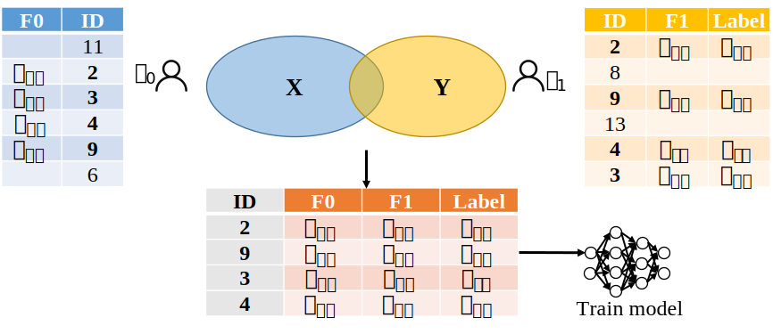

# 使用PSI协议

**1月份更新**：我们实现了一个基于OPRF的两方PSI协议和一个基于Secret sharing的多方PSI协议。


## 运行基于OPRF的两方PSI协议


### 功能介绍
使用我们的PSI功能可以获得两个参与方的Set数据集的交集，并且不暴露额外的信息。


为了适配纵向隐私保护机器学习场景，我们还提供了基于PSI的两个参与方的纵向数据集对齐，对齐后的数据集可以用于隐私保护机器学习。具体功能为：两个参与方各自持有的数据集具有相同的ID空间但是是不同的特征（或标签）空间，首先获得两个参与方的ID数据的交集，并将ID交集内的来自两个参与方的所有特征值合并为一个数据集。




### API
默认双方的数据量是一样的，如果不一样，则先用假数据将小数据量的填充。
```python
# n:  number of data (maxmium)
# f0: number of types of features (including label) from P0
# f1: number of types of features (including label) from P1
# val: dataset after aligning features from two parties
# num: number of ID intersection
val,num = PSI(n,f0,f1)
```
### 使用
Scripts/PSI-Test/run_psi.sh是编译运行的脚本
```shell
bash Scripts/PSI-Test/run_psi.sh r # compile test_psi.mpc
bash Scripts/PSI-Test/run_psi.sh x # compile semi2k virtual machine
bash Scripts/PSI-Test/run_psi.sh t # run test_psi program in two-party
```

## 运行基于Secret Sharing 的多方PSI


该PSI方案支持任意多方（2-N），此外该PSI方案不会泄漏交集的结果。


### 编译虚拟机


在控制台上输入以下命令进行虚拟机编译:
```
make clean
make -j 8 tldr
make -j 8 semi2k-party.x
make -j 8 shamir-party.x
```


### 数据准备

用户需要在Player-Data/Input-P0-0下存放第0方的数据，在Player-Data/Input-P1-0下存放第1方的数据，以此类推。

这些文件的格式为，每行为一个数据样本，第一列为样本的ID，其他列为特征。

假设Player-Data/Input-P0-0中的数据为：

```
1 10 23 30
5 20 30 10
4 20 30 40
```


Player-Data/Input-P1-0中的数据为：

```
1 7 2
6 2 3
4 2 3
9 2 3
```

这些数据表明：第0方提供了3个样本，每个样本除去ID还有3个特征。第1方提供了4个样本，每个样本除去ID还有2个特征


### 脚本编写
对上述的数据进行PSI的代码如下，假设我们将其编写在Programs/Player-Data/ss_psi_test.mpc中

```
table0 = sint.Matrix(3, 4) # 第0方的数据量为3行4列
table1 = sint.Matrix(4, 3) # 第1方的数据量为4行3列

for x in table0:
    x.input_from(0) # 从第0方读入数据

for x in table1:
    x.input_from(1) # 从第1方读入数据

merge_table, n = ss_psi_merge(table0, table1) # 进行PSI并合并两个数据表

```

该代码最终可以获得密态下的合并表格（merge_table），以及密态下的交集中的数据条目（n）。用户可以使用该表格进行下一步的运算。

如果需要支持三方的PSI，则可以编写代码如下。扩展至N方的代码同理。

```
table0 = sint.Matrix(3, 4) # 第0方的数据量为3行4列
table1 = sint.Matrix(4, 3) # 第1方的数据量为4行3列
table2 = sint.Matrix(6, 6) # 第2方的数据量为6行6列

for x in table0:
    x.input_from(0)

for x in table1:
    x.input_from(1)

for x in table2:
    x.input_from(2)

merge_table, n = ss_psi_merge(table0, table1, table2)
```


### 编译
配置好上述脚本后，即可运行以下命令获得编译后的二进制文件。

```
python ./compile.py ss_psi_test -R 64
```

### 运行


如果要运行两方半诚实场景下的PSI，则使用以下命令

```
./Scripts/semi2k.sh ss_psi_test
```


如果要运行大于等于3方（例如5方）场景下的PSI，可以使用以下命令

```
./Scripts/setup-ssl.sh 5
export PLAYERS=5
./Scripts/shamir.sh ss_psi_test
```

