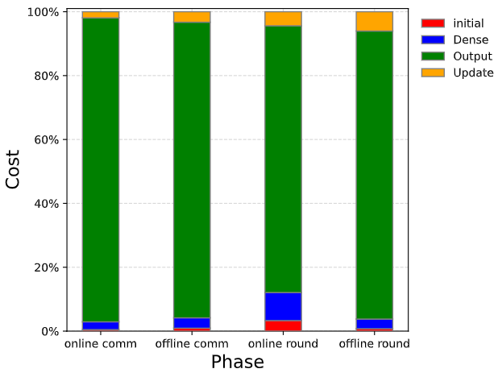
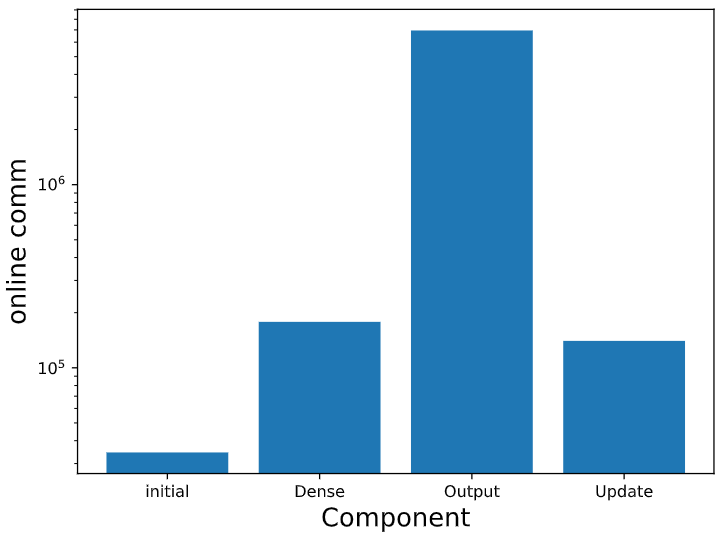

## 模型训练开销Profiling

模型训练开销Profiling是指给定一个mpc语言描述的机器学习模型训练过程，在编译阶段通过对指令进行分析量化每个算子（全连接层、激活函数层、卷积层等）的通信量与通信轮次，为MPC-Friendly模型的设计提供重要参考。目前Garnet中模型训练开销Profiling支持四种协议，包括SecureML、ABY、ABY3、BGW。

### 环境配置
在主目录（/Garnet）下提供了requirements.txt用于配置环境，可以在主目录下执行以下命令完成环境配置.

```
pip install -r ./requirements.txt 
```

### 代码运行
以运行在ABY3上的逻辑回归模型为例。在Programs/Source文件夹下的logreg.mpc文件中，在模型训练代码之前添加start_profiling()调用，之后添加stop_profiling()调用，如下所示，

```
start_profiling() # starting model trainging cost profiling
if not ('forward' in program.args or 'backward' in program.args):
   sgd.run(batch_size=batch)

if 'forward' in program.args:
   @for_range(n_iterations)
   def _(i):
      sgd.forward(N=batch)

if 'backward' in program.args:
   b = regint.Array(batch)
   b.assign(regint.inc(batch))
   @for_range(n_iterations)
   def _(i):
      sgd.backward(batch=b)
stop_profiling() # stopping model trainging cost profiling
```
随后，在Garnet文件夹下运行如下命令，在包含100条100维数据的数据集上训练一个逻辑回归模型并对其训练开销进行Progfiling，并指定底层协议为ABY3。
```
python compile.py -R 64 -Z 3 --profiling -Q ABY3 logreg 100 100
```
输出为
```
initial
       34500 online communication bits
      245700 offline communication bits
           6 online round
         384 offline round
Dense
      178200 online communication bits
      869400 offline communication bits
          16 online round
        1532 offline round
Output
     6949302 online communication bits
    24763347 offline communication bits
         152 online round
       45741 offline round
Update
      140289 online communication bits
      878094 offline communication bits
           8 online round
        3064 offline round
Writing to /home/wqruan/Garnet/Programs/Schedules/logreg-100-100.sch
Writing to /home/wqruan/Garnet/Programs/Bytecode/logreg-100-100-0.bc
Program requires at most:
     7302291 online communication bits
    26756541 offline communication bits
         182 online round
       50721 offline round
```
此外，在Profiling_res文件夹中会自动生成Profiling结果的可视化展示，如下图所示，

</img>
</img>

### 添加新的安全多方计算协议
通过编辑在Compiler/cost_config.py文件中，配置协议基础算子的通信开销，可以灵活地添加新的协议。一个新协议的示例如下所示
```
class ABY3(Cost):
    cost_dict_func = {
        "share": lambda bit_length, kapaa, precision, n_parties: (bit_length*3, 1, 0, 0),
        "open" : lambda bit_length, kapaa, precision, n_parties: (bit_length*3, 1, 0, 0),
        "muls" : lambda bit_length, kapaa, precision, n_parties: (bit_length*3, 1, 0, 0),
        "matmuls": lambda bit_length, kapaa, precision, n_parties, p ,q, r: (p*r*bit_length*3, 1, 0, 0),
        "bit_share":lambda bit_length, kapaa, precision, n_parties: (3, 1, 0, 0),
        "ands":lambda bit_length, kapaa, precision, n_parties: (3, 1, 0, 0)
   }
```
其中share, open, muls, matmuls为必须配置的基础算子，bit_share以及ands在涉及bit share运算时需要配置。此外，bit_length指数据表示的位长，kapaa指计算安全参数，precision指定点数中小数的精度，n_parties指涉及运算的参与方的数量。